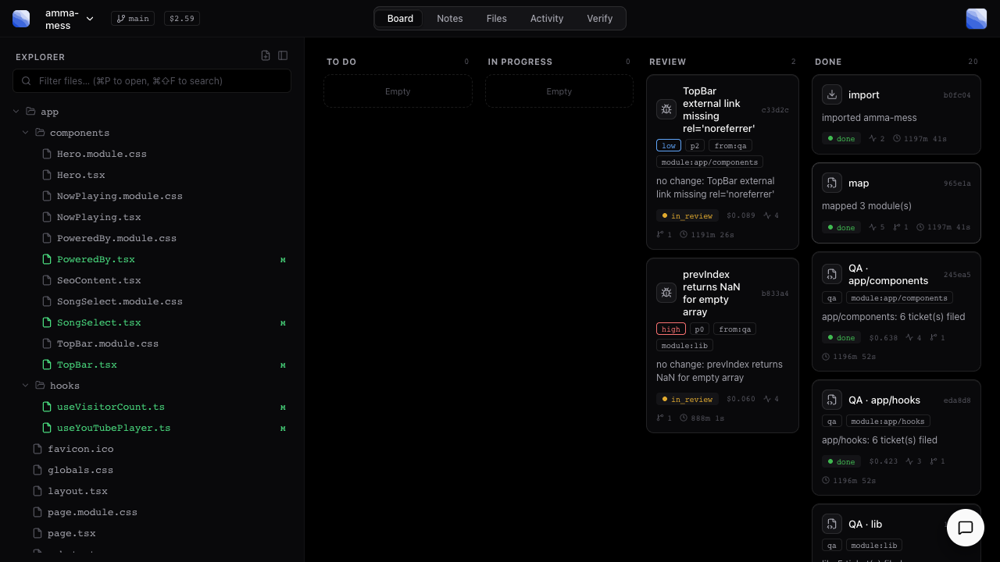

# myAudit — an autonomous, QA-led code-audit IDE

Point it at a codebase. myAudit drives headless **Claude Code** through the real
workflow of a software org: a **QA** pass explores the product module-by-module
and files bug tickets with reproduce steps, then an autonomous **dev** loop picks
up each ticket, fixes the root cause, runs a regression, and closes it — every
step tracked on a **kanban board** with a running **notes** log.

It's a stripped, inverted fork of the *myIntern* orchestration engine: same spine
(a Postgres-free build graph driving `claude -p`), but where myIntern *builds*
apps, myAudit *audits and repairs* an existing one.

```
import → map ─┬→ QA · module A ─→ 🐛 tickets ─→ dev fix ─→ ✅ done
              ├→ QA · module B ─→ 🐛 tickets ─→ dev fix ─→ ✅ done
              └→ QA · module C ─→ 🐛 tickets ─→ dev fix ─→ 🔍 review
```



*A live run: `map` split the repo into modules, per-module **QA** filed tickets
(with severity/priority/reproduce), and the autonomous **dev** loop fixed and
auto-closed them. Changed files are flagged green in the Explorer.*

## How it works (QA over dev)

| stage | model? | what it does |
|---|---|---|
| **import** | no ($0) | copy the target repo into an isolated per-run workspace + git baseline |
| **map** | claude (read-only) | write a product map to notes and **split the repo into modules**, spawning one QA card per module at runtime (the board grows itself) |
| **QA** | claude (**live**) | per module: install deps, run the suite/build, exercise the code, find real bugs + best-practice misses + missing-test gaps, and file **one bug ticket per finding with reproduce steps**. QA drains before any dev work. |
| **dev fix** | claude (**live**) | per ticket (blocked until its module's QA is done): root-cause a minimal fix, commit it, run an **independent regression** — green **auto-closes** to Done; a real failure or an unverifiable/no-diff fix lands in **Review** with a red flag. Never a false "fixed". |

Findings carry **severity** (high/medium/low) and **priority** (P0–P2). The board
is the living logger; `notes` is the running markdown report (product map +
per-module QA + every fix's what & why).

## What makes it minimal

- **One binary + one SQLite file.** No Docker, no Postgres, no migration tool —
  the schema is embedded and applied on open.
- **Your Claude Code auth.** Agent nodes shell out to the `claude` CLI. No API
  keys, no OpenRouter. If it's not Claude Code, it's nothing.
- **The board is the source of truth.** Every task is a row; the whole run is
  queryable at any instant over the JSON API.

## Safety model

- Each run works on an **isolated copy** of your repo under `runs/<id>/`; your
  original is never touched.
- `map` and the chat's questions run under a **read-only** tool policy.
- QA and dev-fix nodes are **live** (they run the product via Bash — install
  deps, boot servers, run tests). This deliberately relaxes confinement so the
  agent can genuinely exercise the code, so **point it at codebases you trust
  (your own).** The agent's environment is scrubbed of myAudit's own server vars,
  and `AGENT_ISOLATE=1` can additionally jail each agent in a container.

## Run it

Prereqs: **Go 1.23+**, **Node 18+**, the **`claude` CLI** (logged in), and **git**.
Live QA also uses whatever the target repo needs on `PATH` (e.g. `npm`). The
desktop shell additionally needs **Rust + `cargo install tauri-cli`**. On boot the
UI shows a banner if `claude`/`git` aren't found.

```bash
make run      # UI + API at http://localhost:7788, REAL Claude Code agent
make dev      # $0 stub agent — exercises the UI/graph; files no tickets, no npm install
make seed     # populate a demo board instantly (no agent, no tokens) — best first look
make test     # full Go suite (temp SQLite per test; no services)
make desktop  # native Tauri shell (needs Rust; auto-starts the server on :7788)
```

`PORT=7799 make run` if 7788 is taken. Set `CLAUDE_MODEL=claude-sonnet-5` (or pick
in Settings) for deeper QA + fixes than the Haiku default.

Start an audit from the UI (**Import codebase**), or over the API:

```bash
curl -XPOST localhost:7788/api/runs \
  -H 'content-type: application/json' \
  -d '{"repo_path":"/abs/path/to/your/repo"}'
```

Then watch the **Board** fill, read the **Notes** log, browse changed files in the
**Explorer** (changed files are flagged green + `M`), and talk to the code in the
floating **chat** — it's real Claude Code over the workspace, and typing `fix`
enqueues the open tickets for the autonomous dev loop.

## Layout

| Package | Responsibility |
|---|---|
| `internal/config` | env config (SQLite path, run pacing) |
| `internal/store` | SQLite `runs`/`nodes`/`events`/`checkpoints`/`notes`/`file_reviews` + tickets + embedded schema |
| `internal/events` | typed, correlated event logger |
| `internal/queue` | atomic node claim + dependency gating (QA-over-dev ordering) |
| `internal/sandbox` | per-run working copy of the imported repo (git baseline, diff, run) |
| `internal/agent` | `claude -p` runner + tool policies (read-only / write / live) |
| `internal/worker` | one node of the audit graph — `import`/`map`/`qa`/`bug` dispatch |
| `internal/api` | JSON API + run loop + embedded web UI |
| `web` / `desktop` | React UI and its Tauri desktop shell |

See [`docs/architecture.md`](docs/architecture.md) for the deep dive.

## Configuration

All optional — see [`.env.example`](.env.example).

| var | default | purpose |
|---|---|---|
| `MYAUDIT_DB` | `./myaudit.db` | SQLite path |
| `CLAUDE_MODEL` | Haiku | agent model — set `claude-sonnet-5` (or Opus) for senior-grade depth |
| `REAL_CLAUDE` | unset | `1` = real agent; unset = $0 stub |
| `AGENT_ISOLATE` | unset | `1` = run each agent inside a container (`AGENT_IMAGE`, default `myaudit-sandbox`) |
| `RUN_PACE_MS` | — | pace the run loop |

## Desktop builds & releases

The desktop app is a Tauri shell around the Go server. The server is bundled as
a Tauri **sidecar**, so a shipped installer runs standalone — it starts the
server on a free-standing port, waits for it, then shows the window (and stops
the server when you quit).

Build one locally:

```bash
./scripts/build-sidecar.sh          # web UI -> embedded in the Go server -> sidecar
cd desktop && npx tauri build       # produces the installer for your platform
```

CI does the same on every tagged push. `.github/workflows/ci.yml` runs `go vet`,
the Go test suite and the web typecheck/build on pushes and PRs to `main`.
`.github/workflows/release.yml` builds installers for macOS (Apple Silicon and
Intel), Linux x86_64 and Windows x86_64, then attaches them to a GitHub Release.

Cut a release by tagging — the tag is the single source of truth for the version,
and it is stamped into `tauri.conf.json`, `Cargo.toml` and `desktop/package.json`
during the build so an installer always traces back to a commit:

```bash
git tag v0.2.0
git push origin v0.2.0
```

You can also run the workflow manually (**Actions → Release desktop app → Run
workflow**) with a version string to produce installers without creating a tag.

## Status & limitations

- **Model.** Defaults to Haiku (cheap; a full small-repo audit is ~$1–3). For the
  "senior engineer" bar, set `CLAUDE_MODEL=claude-sonnet-5`.
- **Live QA runs your code.** It installs deps and boots servers on the host
  unless `AGENT_ISOLATE=1`. Use trusted repos.
- **UI-preview screenshots are best-effort** — captured only if the QA agent can
  render the app headlessly.

## License

[MIT](LICENSE) © codebyNJ.
