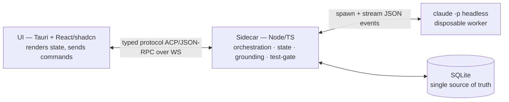
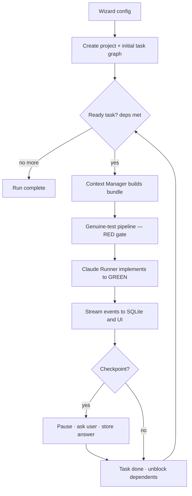
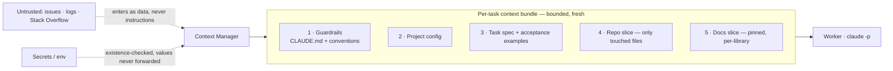
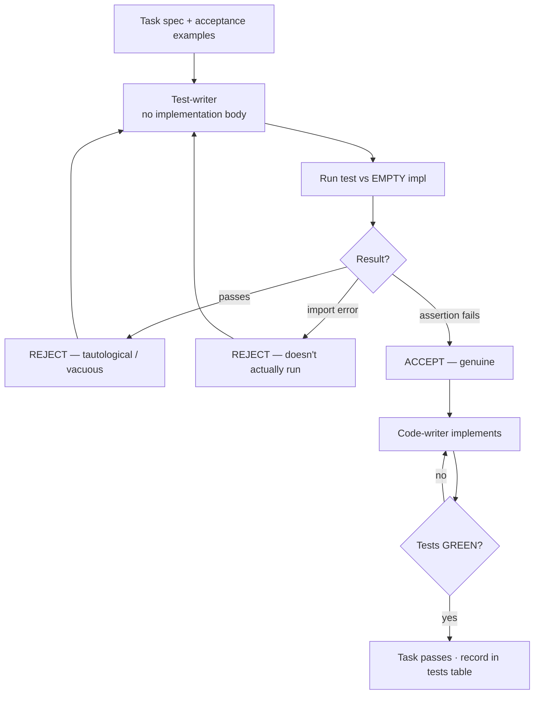
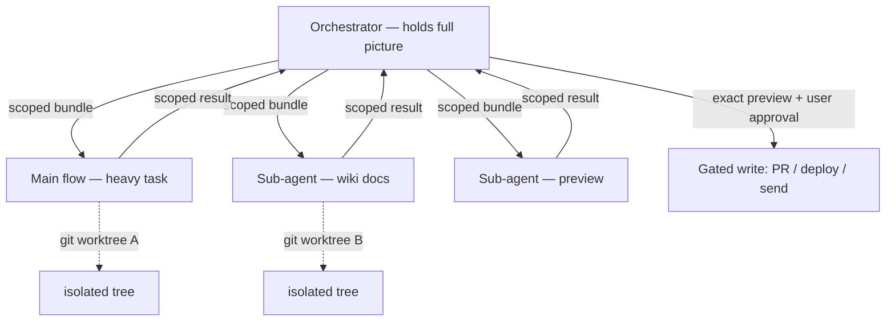
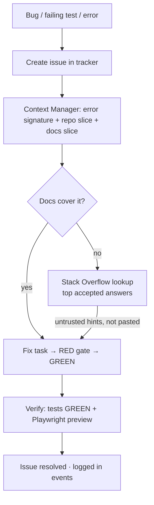

# myIntern — Flow Charts

Rendered companions to [`architecture.md`](architecture.md).

## 1. System overview (three planes)

## 2. Build-run lifecycle

## 3. Per-task context assembly

## 4. Genuine-test RED gate (the anti-hallucination filter)

## 5. Agent communication (clean context + sub-agents)

## 6. Bug to fix loop (Stack Overflow as quarantined hints)

